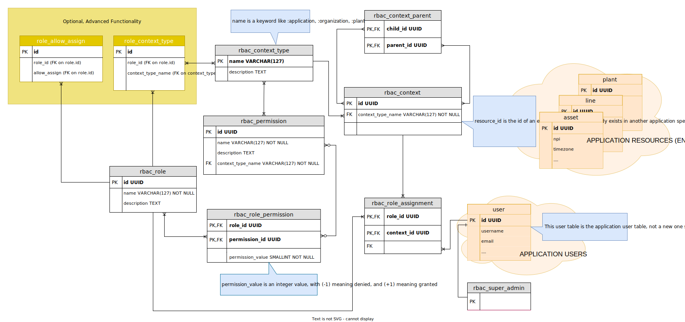

# Make the Context Hierarchy a full Directed Acyclic Graph (DAG)

## Status - Accepted

## Context

Until now the context hierarchy, that is, the relationship between contexts, was a simple tree. Every context had just a single parent. While this hierarchy model applies to a lot of use cases and applications, it does not cover all of them. Recently we have had the need to use the RBAC library in a couple of projects where a simple tree was not enough, and we needed a full DAG to model the context hierarchy. The reason for that was that a given context needed to be related to more than one parent context at the same time.

## Decision

1. The `rbac_context` table will no longer store the parent-child relationship between contexts, because that relationship now needs to be able to model a M x N type of relationship.
2. A new table, named `rbac_context_parent` in the database schema below, will be added to model the M x N parent-child context relationship

## Consequences

* The public API functions dealing with getting, adding, updating and removing context will be changed in a **BREAKING WAY**.
* New public API functions will be added to be able to create and remove parent-child relationships between contexts.
* The database schema will need to be updated by the applications using the library to:
** Create the new `rbac_context_parent` table,
** Migrate the existing parent-child relationships from the `rbac_context` to the `rbac_context_parent` table.
** Drop the `parent_id` column from `rbac_context` table.

## Notes
